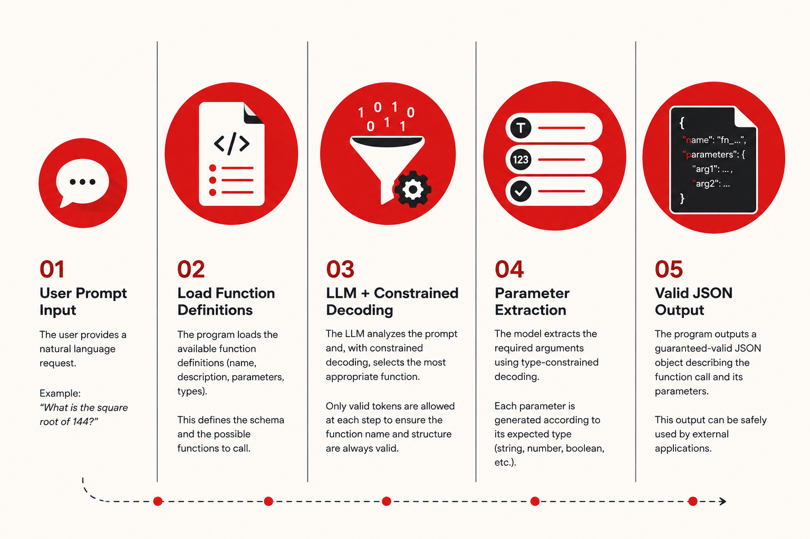

*This project has been created as part of the 42 curriculum by akoudri*

## Description

**Call Me Maybe** is a function-calling system built on top of a small Large Language Model (LLM). Instead of answering a user's request directly, the model translates natural language into a structured JSON object describing the function to execute and the corresponding arguments.

The main challenge of the project is ensuring that every generated response is both syntactically valid and compliant with the expected schema. To achieve this, the project implements **constrained decoding**, restricting the model's token choices at each generation step so that only valid JSON structures, function names, parameter names, and parameter types can be produced.

Given a set of available function definitions and a List of user prompts, the program selects the most appropriate function using the LLM, extracts the required arguments, and generates a guaranteed-valid JSON output that can be safely consumed by external applications.

This project demonstrates how structural constraints can significantly improve the reliability of small language models, allowing them to perform accurate function calling without relying solely on prompt engineering.

## Overall Pipeline

```text
                 User Prompt
                      │
                      ▼
            +------------------+
            |       LLM        |
            +------------------+
                      │
                      ▼
          Constrained Decoder
                      │
      ┌───────────────┼───────────────┐
      │               │               │
      ▼               ▼               ▼
 JSON Structure  Function Name   Parameters
   Generation      Selection      Generation
      │               │               │
      └───────────────┼───────────────┘
                      │
                      ▼
             Valid JSON Output
```

## Overall Pipeline



## Instructions

### Requirements

- Python 3.11 or later
- `uv`
- `pip`

### Installation

Install the required dependencies by running:

```bash
make install
```

If you are using the 42 environment, configure the cache directories before running the project:

```bash
source src/environment.sh
```

### Running

Execute the program with:

```bash
uv run python3 -m src \
    --functions_definition <functions_definition.json> \
    --input <input.json> \
    --output <output.json>
```

or simply:

```bash
make run
```

### Command-line arguments

- `--functions_definition` : Path to the JSON file describing the available functions.
- `--input` : Path to the JSON file containing the user prompts.
- `--output` : Path where the generated JSON responses will be written.

### Development

Run static analysis:

```bash
make lint
```

Remove Python cache files:

```bash
make clean
```

Run the project under the Python debugger:

```bash
make debug
```

## Resources

The following resources were used during the development of this project:

- **AI Engineering** (O'Reilly) — to build a solid understanding of artificial intelligence concepts, language models, large language models (LLMs), model training, and the different machine learning paradigms.
- Various **YouTube** videos, **Medium** articles, and **Reddit** discussions — to study the LLM text generation pipeline, including tokenization, embeddings, transformers, logits, and text generation.
- Discussions with peers — to better understand the concept of constrained decoding and its practical implementation.

### Use of Artificial Intelligence

Artificial intelligence tools were used as learning and development aids throughout the project. They were primarily used to clarify theoretical concepts related to LLMs and constrained decoding, explain the behavior of Python libraries, assist with debugging implementation issues, and review design decisions. The project's architecture, constrained decoding algorithm, implementation, testing, and final code were designed, implemented, and validated by the author.

## Algorithm Explanation

The core of this project is a constrained decoding algorithm that guarantees the generation of valid, schema-compliant JSON. Instead of allowing the language model to freely generate text, the decoder controls the generation process token by token, ensuring that every emitted token is valid in the current context.

The JSON structure is generated deterministically, while the LLM is only responsible for selecting the appropriate function and generating its parameters. To determine the function name, all available function names are first encoded into sequences of token IDs. During decoding, only the tokens corresponding to the next valid position of at least one candidate function are considered. After each generated token, every function whose token sequence no longer matches the generated prefix is eliminated. This progressively reduces the number of candidates until a single function remains, at which point its remaining tokens are appended directly.

Once the function has been selected, parameter generation follows the same constrained approach. The expected type of each parameter is retrieved from the function definition, and only tokens that can produce a valid value of that type are allowed. Separate decoding strategies are used for numbers, strings, booleans, and other supported types, preventing the model from generating invalid values or malformed JSON.

By combining deterministic JSON construction with constrained token selection, the implementation guarantees that every output is valid JSON, conforms to the required schema, and accurately represents the function call predicted by the language model.

## Design Decisions

Several design choices were made to improve both the reliability and efficiency of the implementation. Instead of relying on prompt engineering to produce correctly formatted JSON, the JSON structure is generated manually while the LLM is only responsible for semantic decisions, such as selecting the appropriate function and extracting its parameters. This separation guarantees that the output format is always valid regardless of the model's behavior.

To optimize function selection, all function names are encoded only once at the beginning of the execution. During constrained decoding, candidate functions are progressively eliminated as soon as they no longer match the generated token sequence. This avoids repeatedly scanning every function at each decoding step and significantly reduces the search space as generation progresses.

The decoder was also designed to handle each parameter type independently. Dedicated decoding routines are used for numbers, strings, booleans, and other supported types, making the implementation easier to extend while ensuring that generated values always satisfy the expected schema.

## Performance Analysis

The implementation achieves high reliability by guaranteeing that every generated output is valid JSON and strictly follows the schema defined in the function definitions. Since every token is validated before being generated, malformed JSON structures and invalid parameter types cannot be produced.

To improve execution speed, the constrained decoder progressively reduces the set of candidate functions instead of evaluating every function throughout the entire decoding process. Once a single candidate remains, the rest of the function name is appended directly, reducing the number of LLM inference steps. Function names are also tokenized only once and reused during the entire execution.

The combination of constrained decoding, candidate elimination, and precomputed token sequences allows the program to process all input prompts efficiently while maintaining accurate function selection and parameter extraction.

## Challenges Faced

One of the main challenges was implementing constrained decoding while relying on a small language model. Unlike larger models, the Qwen3-0.6B model frequently produced invalid or unexpected outputs when allowed to generate freely, making it necessary to carefully restrict the set of valid tokens at every generation step.

Another challenge was efficiently selecting the correct function among multiple candidates. A naive implementation would compare every possible function at each decoding step, resulting in unnecessary computations. This was addressed by progressively eliminating candidate functions as soon as they no longer matched the generated token sequence, significantly reducing the search space.

Handling different parameter types also required dedicated decoding logic. Numbers, strings, booleans, and other supported types each have different constraints, making it necessary to implement specialized decoding routines while ensuring that the generated output always remained valid JSON and fully compliant with the required schema.

## Testing Strategy

The implementation was validated using the provided test suite as well as additional custom test cases. Each generated function call was verified to ensure that the selected function matched the user's request, all required parameters were present, and every parameter respected the expected type defined in the function schema.

Special attention was given to edge cases, including negative numbers, floating-point values, strings containing special characters, boolean parameters, and malformed input files. The output JSON was also validated after every execution to confirm that it was always syntactically correct and could be parsed without errors.

Throughout development, extensive debugging and logging were used to monitor the constrained decoding process, making it possible to verify that only valid tokens were considered at each generation step and that candidate functions were eliminated correctly.

## Example Usage

Set the environment variables:

```bash
source src/environment.sh
```

Run the program using the default input and output files:

```bash
make run
```

Or specify custom paths for the function definitions, input prompts, and output file:

```bash
uv run python -m src \
    --functions_definition data/input/functions_definition.json \
    --input data/input/function_calling_tests.json \
    --output data/output/function_calls.json
```

Example output:

```json
[
  {
    "prompt": "What is the sum of 2 and 3?",
    "name": "fn_add_numbers",
    "parameters": {
      "a": 2,
      "b": 3
    }
  }
]
```